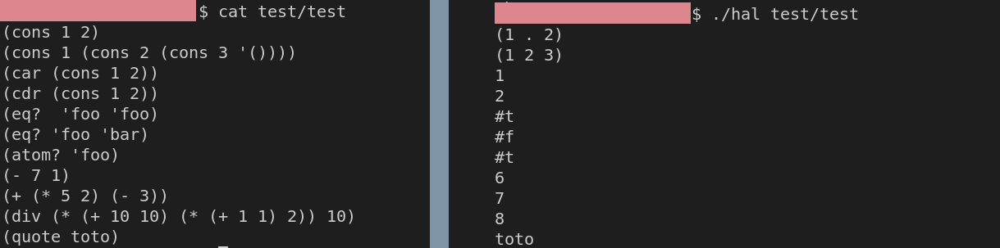

# Intro

Lisp Interpreter. Lisp is a ancient, simple and elegant functional language (quote (who use a lot of parentesis (it's kind of it's thing)(don't worry tho it rarely lead to confusion))).


# Usage and install

The makefile is at the root (use stack):

```
> make 
> ./hal filePath
```

##### Alternative 

`ghc app/Main.hs src/Lib.hs  src/OldLib.hs  -o hal`

#Demo

```
cat test/test
(cons 1 2)
(cons 1 (cons 2 (cons 3 '())))
(car (cons 1 2))
(cdr (cons 1 2))
(eq?  'foo 'foo)
(eq? 'foo 'bar)
(atom? 'foo)
(- 7 1)
(+ (* 5 2) (- 3))
(div (* (+ 10 10) (* (+ 1 1) 2)) 10)
(quote toto)
```
```
./hal2 test/test 
(1 . 2)
(1 2 3)
1
2
#t
#f
#t
6
7
8
toto
```